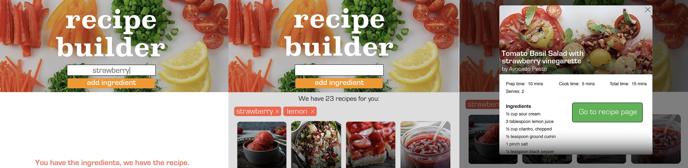

# Recipe Builder

This recipe search uses the Edamam Recipe API to search for recipes based on ingredients.  Enter as many ingredients as you like to search for recipes with that combination. Removing ingredients from your search is as simple as clicking the ingredient name.

Recipe Builder was a response to the need to be creative with ingredients I already had, and going shopping before meal time was not an option.

[Try the Recipe Builder App.](https://alodahl.github.io/RecipeBuilderApp/)

## Technologies used

Recipe Builder employs HTML, CSS styling, JavaScript, custom modal pop-ups, jQuery and AJAX to retrieve and display API data.

## Mocks

